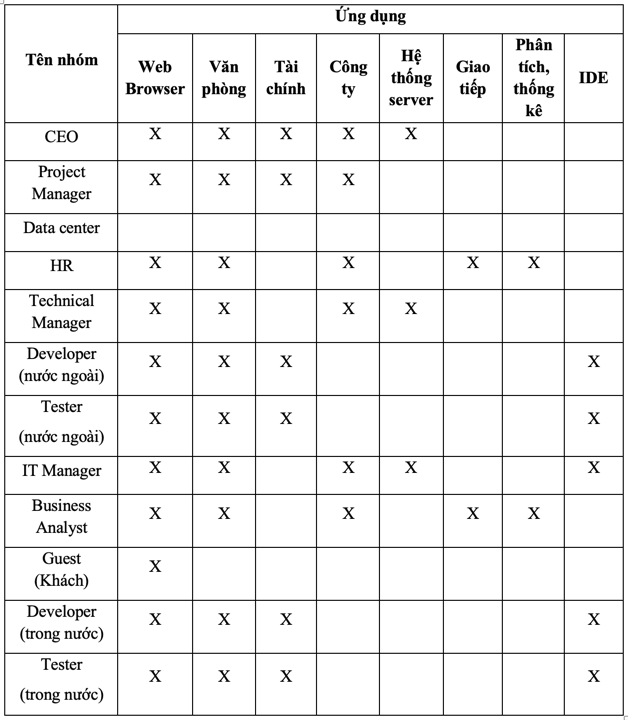
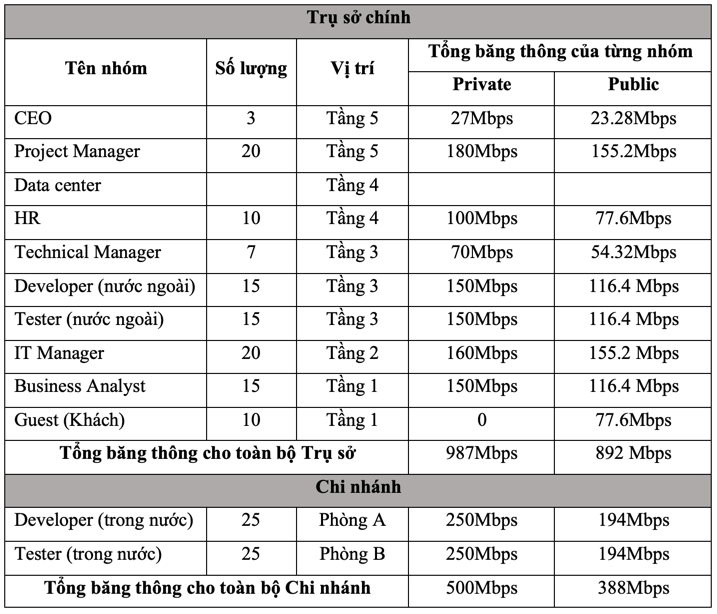
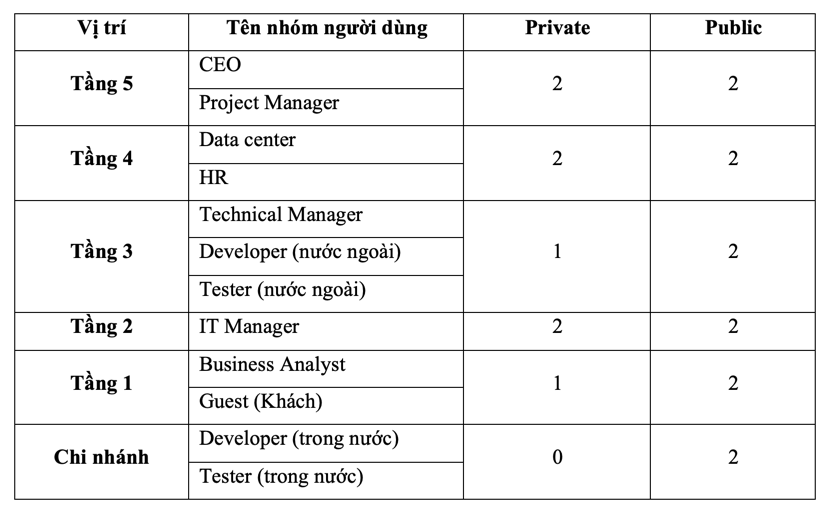

# Enterprise-Network-Model-Design

## 📊 Tổng quan
Công ty Outsource O-UIT có 1 trụ sở chính tại Thủ Đức và một chi nhánh tại Quận 3. Trụ sở
chính là một tòa nhà 5 tầng gồm Data Center và các văn phòng làm việc dành cho CEO, HR,
Project manager, Technical Manager, Business Analyst, IT manager và các nhóm developer
và tester cho các project thuộc thị trường nước ngoài. Chi nhánh tại Quận 3 là văn phòng
làm việc của các nhóm developer và tester cho các project thuộc thị trường trong nước.

## 🎯 Mục tiêu chung
Bài tập này giả định Công ty muốn thiết lập một hệ thống mạng cho trụ sở chính và chi
nhánh với các yêu cầu sau:
- Tại trụ sở chính
  - Developer và Tester chỉ được sử dụng máy bàn tại công ty, không được sử dụng
  laptop riêng để truy cập vào mạng của công ty.
  - CEO, HR, Project manager, Technical Manager, Business Analyst, IT operation được
  sử dụng Laptop, truy cập vào hệ thống wifi nội bộ sử dụng tài khoản xác thực.
  - Một hệ thống wifi public với đường kết nối Internet riêng.
  - Hệ thống phần cứng để triển khai hệ thống server ảo phục vụ cho việc deploy các
  ứng dụng trong giai đoạn test.
  - Sử dụng các dịch vụ Cloud để deploy các ứng dụng trong giai đoạn staging để khách
  hàng sử dụng thử trước khi đưa ra thực tế.
- Tại chi nhánh:
  - Developer và Tester chỉ được sử dụng máy bàn tại công ty, không được sử dụng
  laptop riêng để truy cập vào mạng của công ty.
  - Sử dụng kết nối VPN site-to-site để truy cập server nội bộ và deploy ứng dụng lên hệ
  thống tại Data Center.
  - Một hệ thống wifi với đường kết nối Internet riêng.

## ⭐ Đánh giá từ GVHD
| **Mục**                                | **Điểm**     |
|----------------------------------------|--------------|
| **Giới thiệu tổng quan (5)**           | 5            |
| **Phân tích yêu cầu (10)**             | 10           |
| **Thiết kế hệ thống mạng (45)**        | 40      - OSPF không quản lý động địa chỉ IP - WLC không hỗ trợ quản lý Access point TP-Link |
| **Chi phí cho hệ thống (35)**          | 35           |
| **Kết luận (5)**                       | 5            |
| **Điểm trừ**                           |              |
| **Điểm báo cáo**                       | 95           |
| **Điểm cộng (trên 3 lần nhận xét/phản biện hay)** | 3            |
| **Điểm tổng**                          | 98           |

## 📚 Báo cáo chi tiết
[[Bao cao TKM HK1 2023-2024] – Nhom 03.docx](%5BBao%20cao%20TKM%20HK1%202023-2024%5D%20%E2%80%93%20Nhom%2003.docx)

## 🧠 Phân tích yêu cầu 
-	Công ty O-UIT có 2 trụ sở:
     o	Trụ sở chính (Thủ Đức) gồm 5 tầng, mỗi tầng với diện tích là 30x40m cao 5m, chia thành 2 văn phòng.
     o	Chi nhánh (Quận 3) văn phòng 40x60m.

**Nhu cầu sử dụng ứng dụng của nhóm đối tượng**

**Nhu cầu sử dụng băng thông**

- Tại trụ sở:
    - Tổng băng thông cho mạng nội bộ: 987Mbps cho 105 nhân viên (tương ứng trung bình 9.4Mbps/1 nhân viên).
    - Tổng băng thông cho mạng public: 892 Mbps cho 105 nhân viên + 10 guest (tương ứng trung bình 7.76Mbps/1 người).
- Tại chi nhánh:
    - Tổng băng thông cho mạng nội bộ: 500Mbps cho 50 nhân viên (tương ứng trung bình 10Mbps/1 nhân viên).
    - Tổng băng thông cho mạng public: 388Mbps cho 50 nhân viên (tương ứng trung bình 7.76Mbps/1 nhân viên) với nhu cầu giải trí.

**Nhu cầu Wifi**

- Tại trụ sở:
  - Số lượng access point cho mạng nội bộ: 8 access point. Trong đó tại tầng 1 và 3 chỉ triển khai 1 access point cho mỗi tầng vì nhóm người dùng Developer, Tester và Guest không được truy cập vào wifi nội bộ.
  - Số lượng access point cho mạng wifi public: 10 access point. Mỗi tầng sẽ được lắp 2 access point để đảm bảo vùng phủ sóng ổn định cho toàn bộ user trong tầng.
- Tại chi nhánh: Số lượng access point cho mạng wifi public: 2 access point.

## 🖥️ Thiết kế hệ thống mạng

- Tại Trụ sở: 
  - Phân vùng layer 3 của mạng nội bộ sử dụng 2 kết nối internet kết nối tới 1 firewall. Từ firewall này kết nối tới 2 Switch core layer 3 đóng vai trò là quản lí mạng con, tối ưu hóa định tuyến, đảm bảo hiệu suất mạng và bảo mật mạng, tạo ra môi trường linh hoạt cho các ứng dụng và dịch vụ mạng.

  - Các switch layer 3 trên đều được kết nối tới phân vùng layer 2 với các switch layer 2 được bố trí tại mỗi tầng, mỗi phòng ban của công ty, mỗi switch layer 2 tại mỗi phòng được kết nối với các Access Point nội bộ cũng như các thiết bị đầu cuối khác (máy tính bàn, máy in, camera, máy chiếu, …) giúp các thiết bị đó kết nối tới mạng.
  - Tại mỗi tầng đều có các Access Point nội bộ, người dùng cần phải xác thực tài khoản và mật khẩu để kết nối, riêng đối với Developer và Tester sẽ không thể đăng nhập vào mạng wifi này.
  - Đối với mạng public: 2 đường internet từ nhà cung cấp dịch vụ mạng sẽ được kết nối tới một Router, thông qua một switch để kết nối tới các Access Point dành cho người dùng khách truy cập hoặc dùng cho các nhu cầu về giải trí, nghỉ ngơi của nhân viên
  - Hệ thống Datacenter của công ty được đặt tại tầng 4, bao gồm các Server đảm nhận nhiều vai trò và Wireless controller, được kết nối tới firewall thông qua 1 switch layer 2.
- Tại Chi nhánh: 
  - Mạng nội bộ sử dụng 1 Router để kết nối ra ngoài internet, Router kết nối tới 1 Switch layer 3 đóng vai trò quản lí các mạng con bên trong.
  - Các thiết bị sẽ có địa chỉ thuộc 2 VLAN và được kết nối tới Switch layer 3 thông qua 3 switch con.
  - Đối với mạng public dành cho khách: Access Point của mạng wifi public sẽ được kết nối tới Router với đường internet riêng biệt.

## 📈 Đánh giá mức độ hoàn thành
### 1. Môi trường cho Developer & Tester

👥 Quy mô: 80 người (30 trụ sở + 50 chi nhánh)  
🖥️ Thiết bị: Chỉ dùng máy bàn công ty  
🔐 Bảo mật: VLAN riêng + xác thực ADDS/Radius  
✅ Đáp ứng: 100%  

### 2. Môi trường cho Ban Lãnh đạo & Quản lý

👥 Quy mô: 75 người  
💻 Thiết bị: Cho phép laptop cá nhân  
📡 Kết nối: Wifi nội bộ (2 AP/tầng)  
🔒 Bảo mật: VLAN riêng theo phòng ban  
⭐ Đáp ứng: 90%  

### 3. Wifi Công cộng

📡 Phủ sóng: 1 AP/tầng  
🔄 Kết nối: Switch + Router riêng  
✅ Đáp ứng: 100%  

### 4. Hệ thống Server Testing

💾 Cấu hình: RAM ≥ 1TB, hỗ trợ ảo hóa  
🔄 Platform: VMware vSphere Essential  
🌐 Dịch vụ: DNS, Web, Mail, CA, FTP  
✅ Đáp ứng: 100%  

### 5. Cloud cho Staging

🌐Dịch vụ AWS: EC2 & Fargate, S3 & RDS MySQL, CloudWatch, CodeDeploy  
💰 Chi phí: ~12.2M VNĐ/tháng  
✅ Đáp ứng: 100%  

### 6. Kết nối VPN

🔗 Loại: Site-to-site  
🛡️ Thiết bị: Pfsense  
🚀 Băng thông: 300 Mbps  
🌐 IP: 4 public tĩnh  
✅ Đáp ứng: 100%  

### Tổng kết Đáp ứng

🎯 Hầu hết các mục: 100%  
⚠️ Riêng mục 2 (Ban Lãnh đạo): 90%
